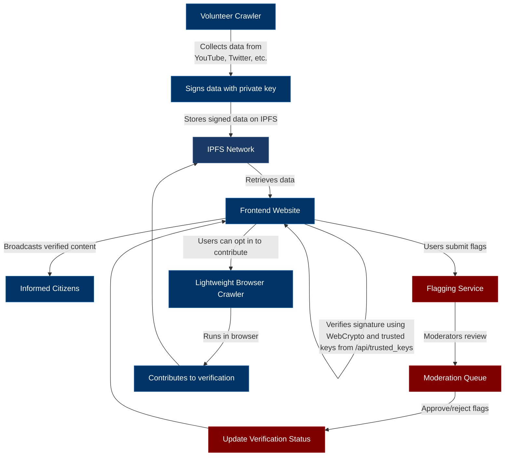
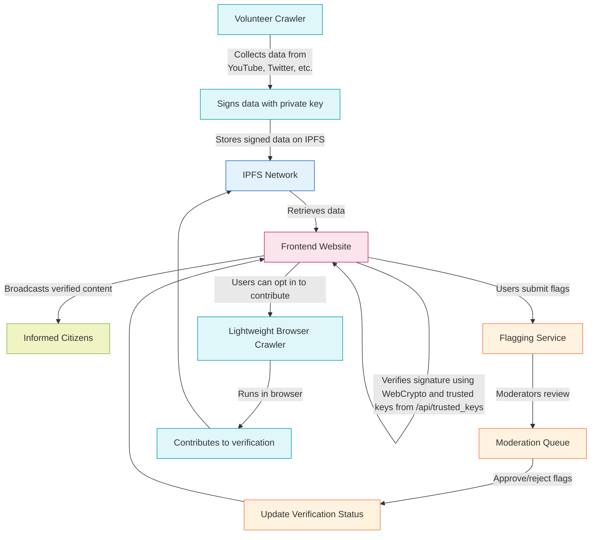

# LodeStar

Preserving democracy through verified truth: Aggregating political statements and actions to inform voters and prevent decisions against their interests.

## Welcome to LodeStar!

We're building a decentralized platform to fight misinformation and preserve democracy through verified truth. We believe that an informed citizenry is the cornerstone of a healthy democracy, and we need your help to make this vision a reality.

LodeStar automatically collects, verifies, and presents political statements alongside their real-world outcomes, helping people see the difference between rhetoric and reality.

## Core Principles
- **Truth-First**: Only present verified facts without editorialization
- **Decentralized**: Hosted via IPFS to prevent takedowns
- **Historical Transparency**: Highlight historical government statements and their subsequent actions
- **Democracy Preservation**: Empowering voters with verified truth to make informed decisions that protect democratic values
- **Inclusive Participation**: Enable anonymous contribution to fighting misinformation
- **Non-Partisan**: Analyzes all government statements and actions
- **Transparent**: Publicly accessible data sources and methodology

## Data Sources
- Government press releases and official statements (including historical)
- Fact-checking platforms (Ground News, PolitiFact)
- News archives covering multiple administrations (including historical)
- Social media from all political figures
- Public policy documents and voting records
- Historical government statements and actions

## How It Works
1. **Distributed Crawling**: Volunteer-run crawlers collect information from various sources
2. **Verification**: Data is cryptographically signed by volunteers and verified both on the backend and client-side using WebCrypto. Browsers fetch trusted public keys from `/api/trusted_keys` and verify signatures independently, ensuring decentralization and censorship resistance
3. **Storage**: Content is stored on IPFS for permanent, uncensorable access
4. **Presentation**: Verified information is displayed in an easy-to-understand format

## Project Structure
```
lodestar/
├── src/
│   ├── api/          # REST API endpoints
│   ├── crawler/      # Volunteer crawler nodes
│   ├── processor/    # Data processing pipeline
│   ├── utils/        # Utility modules (verification, flagging, etc.)
│   ├── models/       # Data models
│   └── websocket/    # WebSocket server
├── frontend/         # Static HTML/CSS/JS interface
└── ipfs-deploy/      # Automated IPFS deployment workflow
```

## Volunteer Program
LodeStar is powered by volunteers like you! You can contribute in several ways:

### Run a Crawler Node
- Help collect data by running a crawler from your own machine
- All data is cryptographically signed for verification
- No public attribution required - you can contribute anonymously
- Data is stored directly on IPFS for permanent access
- Volunteers must generate a public key and submit it to the system administrator for inclusion in the trusted keys list

### Contribute to Development
- Help improve the codebase
- Add new features
- Fix bugs
- Improve documentation

### Spread the Word
- Share LodeStar with others
- Help raise awareness about the importance of verified information

See `frontend/volunteer.html` for detailed instructions on becoming a volunteer crawler.

## Installation and Setup

1. Install the required dependencies:
   ```
   pip install -r requirements.txt
   ```

2. Install IPFS:
   - Download and install IPFS Desktop from https://ipfs.tech/
   - Or install IPFS command-line tools from https://dist.ipfs.tech/#kubo

3. Start the IPFS daemon:
   ```
   ipfs daemon
   ```

4. Add trusted public keys (for initial setup or administration):
   - Use the `/api/add_trusted_key` endpoint to add trusted public keys
   - Example: `curl -X POST http://localhost:5000/api/add_trusted_key -H 'Content-Type: application/json' -d '{"public_key": "YOUR_PUBLIC_KEY_HERE"}'`

## Running the Application

1. Start the WebSocket server:
   ```
   python websocket_server.py
   ```

2. Start the frontend server:
   ```
   cd frontend
   python -m http.server 8000
   ```

3. Access the application at http://localhost:8000

## Contributing

We welcome contributions from the community! LodeStar is a collaborative effort to preserve democracy through verified truth.

### How You Can Contribute
- **Code**: Help develop new features, fix bugs, or improve existing functionality
- **Crawlers**: Run a crawler node to help collect data
- **Documentation**: Improve our documentation to help others understand and use LodeStar
- **Testing**: Test the application and report issues
- **Design**: Help improve the user interface and user experience
- **Community**: Spread the word about LodeStar and its mission
- **Trusted Key Management**: Help implement and document the process for adding and managing trusted public keys

### Getting Started
1. Fork the repository
2. Create a feature branch
3. Make your changes
4. Submit a pull request

Please see our contribution guidelines for more detailed information.

## Community

Join our community of volunteers working to preserve democracy through verified truth:

- **GitHub Issues**: Report bugs or request features
- **Discussions**: Engage with other contributors and users

## License

This project is licensed under the MIT License - see the LICENSE file for details.

## Contact

For questions, suggestions, or support, please open an issue on GitHub.

## How LodeStar Works: A Decentralized Truth Network

## How LodeStar Works: A Decentralized Truth Network




## Why LodeStar Cannot Be Taken Down

LodeStar is designed as a truly decentralized system that cannot be controlled or shut down by any single entity:

1. **No Central Server**: LodeStar has no central server or database that can be targeted. All data is stored on IPFS, a peer-to-peer network with thousands of nodes worldwide.

2. **Cryptography-Based Trust**: Data is verified using cryptographic signatures both on the backend and client-side using WebCrypto. Browsers can verify data using trusted keys stored locally, making the system resilient against backend downtime.

3. **Volunteer-Powered Network**: Thousands of volunteers around the world run crawlers that collect data. Shutting down one volunteer's machine has no effect on the overall system.

4. **Anonymous Participation**: Volunteers can participate without revealing their identity, making it impossible to target individuals.

5. **IPFS Decentralization**: IPFS distributes content across the entire network. Even if some nodes go offline, the data remains accessible through other nodes.

6. **Frontend Independence**: The frontend website is just a viewer - it's possible to host alternative interfaces on different domains or even run them as standalone applications.

7. **Open Source**: The entire codebase is open source, meaning anyone can fork the project and run their own instance.

8. **No Single Point of Failure**: There is no single administrator, company, or government that controls LodeStar. The system is governed by its community of volunteers and the immutable nature of cryptographic verification.

LodeStar is not just a website - it's a movement. It's a truth network built by the people, for the people, that cannot be silenced.